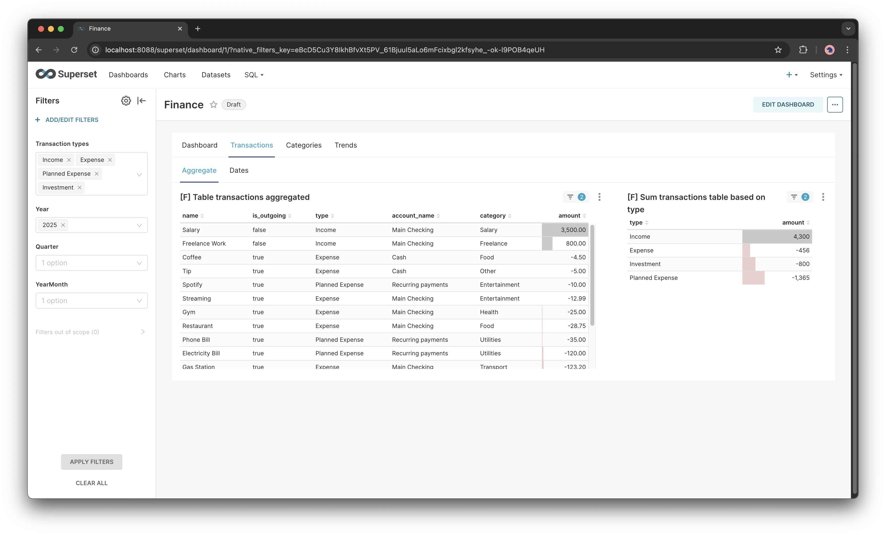

<div align="center">
  
  <h3>Truly private and customizable Personal Finance System 💰</h3>
  <a href="#functionalities">Functionalities</a> •
  <a href="#screenshots">Screenshots</a> •
  <a href="#getting-started">Getting Started</a>
</div>

> [!NOTE]
> Hi! I am Martin and I would like to share with you app that I developed. I decided to share my work so it can be helpful to anybody. I will be pleased if you can make this repository useful to you. Fork it, reuse any of parts as you like.
> Feel free to contact me with any questions or problems. Have a nice day! Martin

## What is FinSys?
FinSys is a local Personal **Fin**ance Management **Sys**tem that is build for customization. It's core is PostgreSQL database that will unite data from all your sources (banks, cash wallet).

Built for month revision workflow - after end of calendar month you are going to import every transaction from previous month into FinSys and revise your finance health.

FinSys supports adding transactions manually or via csv file.

For data visualization I use Superset, but you can use whatever you want - even Excel. Superset supports multiple dynamic filters - you can filter by date you want, types of transactions etc.

FinSys is divided into 2 separate parts:
1. Import Wizard (SvelteKit web application)
2. Data visualization (Superset)


> [!TIP]
> More screenshots: [Screenshots](#screenshots)

### Why I created FinSys?
I was using Excel for long time. It was lot of hassle to make it work. I never achieved 100% accuracy of data even when using macros. Creating multi-month spreadsheets were a nightmare.

I tried existing finance management apps (like Spendee) but it didn't do a great job at categorizing transactions and auto-mapping transfers between accounts. While I didn't want to pay another subscription to manage my subscriptions 🙃

So I created my own finance system. I love the solidity and correctness of data in full SQL db - not just random excel spreadsheets.

## What is Superset?
[Apache Superset](https://github.com/apache/superset) is an open-source data visualization platform. You can easily create dashboards and charts right from your database.


## Getting Started

> [!NOTE]
> Requirements:
> - Docker
> - Node (version 22)
> - Yarn (version 1.22)

Clone project
```bash
git clone git@github.com:martinskalik/finsys.git
cd finsys
```

### Start Postgres and Superset

```bash
# Start Postgres db and Superset
docker compose up -d

# Create db views and triggers
docker exec -i finsys-postgres psql -U postgres -d finsys < scripts/sql/db-views.sql
docker exec -i finsys-postgres psql -U postgres -d finsys < scripts/sql/updated-at-trigger.sql

# Add Initial demo data to DB
docker exec -i finsys-postgres psql -U postgres -d finsys < scripts/sql/mock-data.sql

echo "Hurayy! Superset is now available on 'http://localhost:8088/'."
```

### Import dashboards into Superset
1. Open Superset application http://localhost:8088/
2. Navigate to 'Dashboards'
3. Click "Import dashboards" button at top left of the screen
4. Pick a file `superset/dashboards/dashboards.zip`
5. Enter DB user postgres's password (can be found in `docker-compose.yml`)
You should see all dashboards now!

### Start import wizard app
```bash
cp .env.example .env
yarn dev
```

### Aditional manual setup

> [!TIP]
> This step is not required if you want to only see demo data in Superset.

> [!NOTE]
> These steps require some SQL management app (or you can use plain SQL if you are brave enough 😉).

> [!TIP]
> I personally use [Beekeeper studio](https://www.beekeeperstudio.io/) on Mac, it's free. Alternatively you can use inbuilt web sql studio from drizzle - that looks really nice and no additional connection settings are required `yarn run db:studio`.

Create your accounts (wallets) in `accounts` table.

Next thing you will have to input initial balances of accounts. Create row in `account_balances` table for each account. Put first day of month you want to import - e.g. `2025-09-01` if you are going to import September.

## Functionalities
### Aggregating multiple bank/cash accounts
### Import transactions from CSV
### Transactions-Balance check
Mechanism to make sure that all transactions are recorded and no mistakes were made.

Wizard calculates net transactions for specific month and compares it to starting and ending balance of account.

### Tracking subscriptions and recurring payments (planned expenses)
Dashboard
Mapping transactions - You can see how much you spend on this subscriptions
### Automapping transfers between accounts
### Exploring long trends


## Roadmap
No specific deadlines - I will try to improve what will show as biggest problem.

### Backlog
- Wizard Step validations
- CSV import custom schemas
- Managing Investments
- Transactions table
    - category autocomplete
    - Undo and Redo
    - Pagination and sort
- Support transactions in multiple currencies
    - Currently FinSys is "currency agnostic" (takes number and doesn't care about currency - assumes all amounts are the same currency)
- E2E tests

## Screenshots

### Superset




### Import wizard

